# Shopee Scraper - Architecture & Pipeline Diagrams

## 1. System Architecture Overview

```mermaid
flowchart TB
    subgraph INPUT["📥 INPUT LAYER"]
        UI[User Input]
        CFG[Config File]
        CLI[CLI Arguments]
    end

    subgraph CONFIG["⚙️ CONFIGURATION"]
        direction TB
        KW[Keywords/URLs]
        PROXY[Proxy Settings]
        CRED[Credentials]
        OPTS[Scrape Options]
    end

    subgraph CORE["🦊 CAMOUFOX CORE ENGINE"]
        direction TB
        
        subgraph ANTI["🛡️ Anti-Detection Layer"]
            FP[Fingerprint Spoofing]
            UA[User-Agent Rotation]
            WGL[WebGL Spoof]
            CVS[Canvas Spoof]
        end
        
        subgraph BROWSER["🌐 Browser Automation"]
            BRW[Camoufox Browser]
            CTX[Browser Context]
            PG[Page Instance]
        end
        
        subgraph SESSION["🔐 Session Management"]
            AUTH[Authentication]
            COOK[Cookie Manager]
            PERSIST[Session Persistence]
        end
    end

    subgraph NETWORK["🌍 NETWORK LAYER"]
        direction TB
        PROT[Proxy Rotator]
        RES[Residential Proxies]
        RATE[Rate Limiter]
        RETRY[Retry Handler]
    end

    subgraph SHOPEE["🛒 SHOPEE TARGETS"]
        direction TB
        SEARCH[Search API v4]
        PDP[Product Detail]
        SHOP[Shop Products]
        REV[Reviews]
    end

    subgraph EXTRACT["📊 DATA EXTRACTION"]
        direction TB
        NAV[Page Navigator]
        WAIT[Smart Waiter]
        SEL[Selector Engine]
        PARSE[Data Parser]
    end

    subgraph PROCESS["🔄 DATA PROCESSING"]
        direction TB
        CLEAN[Data Cleaner]
        VALID[Validator]
        TRANS[Transformer]
        DEDUP[Deduplicator]
    end

    subgraph OUTPUT["📤 OUTPUT LAYER"]
        direction TB
        JSON[(JSON Files)]
        CSV[(CSV Files)]
        DB[(Database)]
        API[REST API]
    end

    subgraph MONITOR["📈 MONITORING"]
        LOG[Logger]
        METRIC[Metrics]
        ALERT[Alerts]
    end

    %% Connections
    INPUT --> CONFIG
    CONFIG --> CORE
    CORE --> NETWORK
    NETWORK --> SHOPEE
    SHOPEE --> EXTRACT
    EXTRACT --> PROCESS
    PROCESS --> OUTPUT
    
    CORE -.-> MONITOR
    NETWORK -.-> MONITOR
    EXTRACT -.-> MONITOR

    %% Styling
    classDef inputStyle fill:#e1f5fe,stroke:#01579b
    classDef coreStyle fill:#fff3e0,stroke:#e65100
    classDef networkStyle fill:#f3e5f5,stroke:#7b1fa2
    classDef extractStyle fill:#e8f5e9,stroke:#2e7d32
    classDef outputStyle fill:#fce4ec,stroke:#c2185b
    
    class INPUT,UI,CFG,CLI inputStyle
    class CORE,ANTI,BROWSER,SESSION coreStyle
    class NETWORK,PROT,RES networkStyle
    class EXTRACT,PROCESS extractStyle
    class OUTPUT,JSON,CSV,DB outputStyle
```



---

## 2. Processing Pipeline (Start to End)

```mermaid
flowchart TD
    START((🚀 START)) --> INPUT

    subgraph INPUT["1️⃣ INPUT PHASE"]
        A1[Load Config File] --> A2[Parse CLI Arguments]
        A2 --> A3[Validate Input Parameters]
        A3 --> A4{Valid?}
    end

    A4 -->|No| ERR1[❌ Show Error & Exit]
    A4 -->|Yes| INIT

    subgraph INIT["2️⃣ INITIALIZATION PHASE"]
        B1[Initialize Logger] --> B2[Setup Proxy Pool]
        B2 --> B3[Load Saved Cookies]
        B3 --> B4[Initialize Camoufox]
        B4 --> B5[Apply Fingerprint Config]
        B5 --> B6[Create Browser Context]
    end

    INIT --> SESSION

    subgraph SESSION["3️⃣ SESSION PHASE"]
        C1{Cookies Valid?}
        C1 -->|Yes| C5[Restore Session]
        C1 -->|No| C2[Navigate to Login]
        C2 --> C3[Perform Login]
        C3 --> C4{CAPTCHA?}
        C4 -->|Yes| CAP[Solve CAPTCHA]
        CAP --> C3
        C4 -->|No| C5
        C5 --> C6[Save Cookies]
    end

    SESSION --> QUEUE

    subgraph QUEUE["4️⃣ TASK QUEUE"]
        D1[Load Target URLs/Keywords]
        D1 --> D2[Create Task Queue]
        D2 --> D3[Prioritize Tasks]
    end

    QUEUE --> SCRAPE

    subgraph SCRAPE["5️⃣ SCRAPING LOOP"]
        E1[Get Next Task] --> E2[Select Proxy]
        E2 --> E3[Navigate to Page]
        E3 --> E4{Page Loaded?}
        E4 -->|No| E10{Retry < Max?}
        E10 -->|Yes| E11[Wait & Rotate Proxy]
        E11 --> E2
        E10 -->|No| E12[Log Failed & Skip]
        E12 --> E9
        E4 -->|Yes| E5[Wait for Content]
        E5 --> E6[Extract Raw Data]
        E6 --> E7[Parse Data Structure]
        E7 --> E8[Validate Extracted Data]
        E8 --> E9{More Tasks?}
        E9 -->|Yes| RATE
        E9 -->|No| PROCESS
    end

    subgraph RATE["⏱️ RATE CONTROL"]
        F1[Random Delay]
        F1 --> F2[Check Rate Limit]
        F2 --> F3{Limit Hit?}
        F3 -->|Yes| F4[Extended Wait]
        F4 --> E1
        F3 -->|No| E1
    end

    subgraph PROCESS["6️⃣ DATA PROCESSING"]
        G1[Aggregate Results] --> G2[Clean Data]
        G2 --> G3[Remove Duplicates]
        G3 --> G4[Transform Format]
        G4 --> G5[Validate Schema]
    end

    PROCESS --> OUTPUT

    subgraph OUTPUT["7️⃣ OUTPUT PHASE"]
        H1{Output Format}
        H1 -->|JSON| H2[Write JSON File]
        H1 -->|CSV| H3[Write CSV File]
        H1 -->|Database| H4[Insert to DB]
        H1 -->|All| H5[Multi-format Export]
        H2 & H3 & H4 & H5 --> H6[Generate Report]
    end

    OUTPUT --> CLEANUP

    subgraph CLEANUP["8️⃣ CLEANUP PHASE"]
        I1[Save Session State] --> I2[Close Browser]
        I2 --> I3[Release Proxies]
        I3 --> I4[Log Statistics]
    end

    CLEANUP --> FINISH((✅ END))
    ERR1 --> FINISH

    %% Styling
    style START fill:#4caf50,stroke:#2e7d32,color:#fff
    style FINISH fill:#4caf50,stroke:#2e7d32,color:#fff
    style ERR1 fill:#f44336,stroke:#c62828,color:#fff

```



---

## 3. Component Description

### Core Components

| Component | Technology | Purpose |
|-----------|------------|---------|
| **Camoufox** | Python + Firefox | Anti-detect browser dengan 0% detection rate |
| **Fingerprint Spoofing** | Built-in Camoufox | Canvas, WebGL, AudioContext, Navigator |
| **Proxy Rotator** | Custom | Residential proxy rotation untuk Indonesia |
| **Session Manager** | Cookie/JSON | Login state persistence |
| **Rate Limiter** | Custom | Prevent rate limiting (~100 req/min) |
| **Data Parser** | BeautifulSoup/JSON | Extract structured data |

### Data Flow Summary

```
INPUT → CONFIG → BROWSER_INIT → LOGIN → SCRAPE_LOOP → PROCESS → OUTPUT
                      ↑              ↓
                 PROXY_ROTATE ← RATE_LIMIT
```

### API Endpoints Targeted

| Endpoint | Purpose |
|----------|---------|
| `/api/v4/search/search_items` | Product search |
| `/api/v4/pdp/get_pc` | Product detail |
| `/api/v4/shop/rcmd_items` | Shop products |
| `/api/v4/pdp/get_rw` | Product reviews |

---

## 4. Tech Stack Summary


---

*Generated for Shopee Scraper Project*
